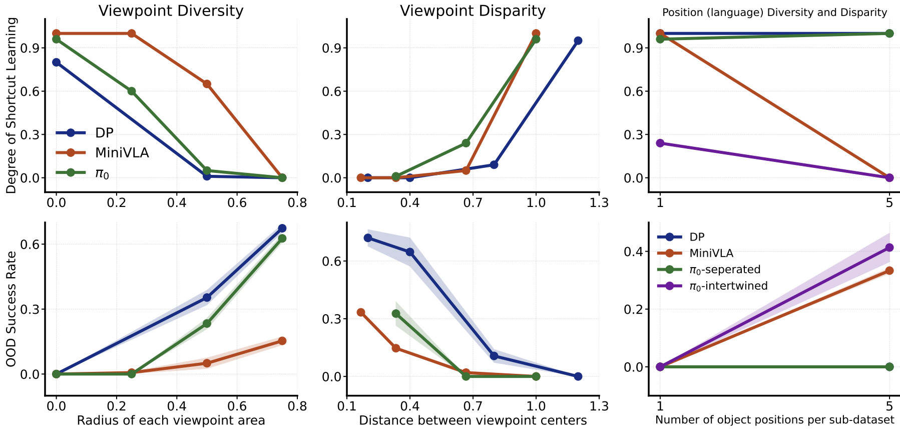

# Shortcut Learning in Generalist Robot Policies

This repository is the official code release for "Shortcut Learning in Generalist Robot Policies: The Role of Dataset Diversity and Fragmentation" (CoRL 2025).

The codebase builds upon the official repositories of [openvla-mini](https://github.com/Stanford-ILIAD/openvla-mini), [LeRobot](https://github.com/huggingface/lerobot), and [LIBERO](https://github.com/Lifelong-Robot-Learning/LIBERO).

Please see the [blog](https://lucky-light-sun.github.io/proj/shortcut-learning-in-grps/) and [paper](https://arxiv.org/abs/2508.06426) for more details.


## Update and ToDo

1. Environment setup
2. Release and test dataset generation code
3. Release and test diffusion policy code
4. Release and test OpenVLA-Mini (Please see the blog and paper for more details.MiniVLA) code

Pi0 code release: TODO


## Installation


Environment setup for generating the LIBERO shortcut datasets (see Section 3.3, Experimental Verification on LIBERO, in our paper). The same environment is also used for training MiniVLA.


To install the envrionment, you should execute the following commands in sequence.

```bash
git clone https://github.com/Lucky-Light-Sun/shortcut-learning-in-grps.git 
conda create -n shortcut-learning python=3.10 -y
conda activate shortcut-learning


# You may use a different PyTorch version, but we recommend this exact combo as others may fail.
# Official guides: https://pytorch.org/get-started/locally/ and https://pytorch.org/get-started/previous-versions/
pip install torch==2.2.0 torchvision==0.17.0 torchaudio==2.2.0 --index-url https://download.pytorch.org/whl/cu121


# Enter the project root
cd shortcut-learning-in-grps
pip install -e .

# Install FlashAttention 2 (speeds up attention during training): https://github.com/Dao-AILab/flash-attention
# Tip: if the build fails, try: `pip cache remove flash_attn` first
pip install packaging ninja
ninja --version; echo $?  # Verify Ninja is available (exit code should be 0)
pip install "flash-attn==2.5.5" --no-build-isolation


# Install the LIBERO project package for dataset generation
cd LIBERO
pip install -e .
cd ..
pip install -r experiments/robot/libero/libero_requirements.txt


# LeRobot (for dataset format conversion)
git clone https://github.com/Lucky-Light-Sun/lerobot.git
cd lerobot 
pip install -e .

# RLDS dataset builder
cd ..
cd dataset_git
git clone https://github.com/Lucky-Light-Sun/rlds_dataset_builder.git

# VQ-BET (for action tokenization/chunking)
git clone https://github.com/jayLEE0301/vq_bet_official.git
cd vq_bet_official
pip install -r requirements.txt
pip install -e .


# Pin specific package versions for compatibility with our experiments
cd ..
pip install robosuite==1.4.0 transforms3d==0.4.2
pip install torchcodec==0.2.1 diffusers==0.32.2
pip install datasets==3.4.1 huggingface-hub==0.29.2 draccus==0.8.0
pip install imageio==2.37.0
pip install numpy==1.26.4
```


Environment setup for training diffusion policy.

```bash
cd shortcut-learning-in-grps/lerobot
conda create -y -n lerobot python=3.10
conda activate lerobot
pip install -e .
pip install torch==2.6.0 torchvision==0.21.0 torchcodec==0.2.1
pip install datasets==3.4.1 huggingface-hub==0.29.2 draccus==0.10.0
```


## Dataset Generation for LIBERO Shortcut Datasets

We use the LIBERO Object suite as the simulation dataset. It contains 10 tasks.
- For Diffusion Policy, we use tasks 0 and 4 to construct two data islands.
- For OpenVLA-Mini, we construct two islands using tasks {0,1,3,5,8} and {2,4,6,7,9}.


Step 1: Download the original LIBERO Object dataset. The LIBERO shortcut datasets are derived from this dataset by rotating the camera viewpoints.

```
dataset_path="/mnt/hdd4/xingyouguang/datasets/libero"
conda activate shortcut-learning
cd LIBERO
python benchmark_scripts/download_libero_datasets.py --datasets libero_spatial --download-dir "${dataset_path}"


export HF_ENDPOINT=https://hf-mirror.com
hf download --repo-type dataset --include "libero_spatial/*" --local-dir ./ yifengzhu-hf/LIBERO-datasets
```

Step 2: Modify camera viewpoints (task-irrelevant factor) to construct dataset islands. To reproduce experiments like Figure 6 in our paper (also shown in the Results section below), we provide multiple dataset configurations.
For Diffusion Policy, there are 3 viewpoint-diversity settings and 4 viewpoint-disparity (distance) settings.
For OpenVLA-Mini, there are 4 viewpoint-diversity settings and 4 viewpoint-disparity (distance) settings.

Choose any configuration based on your needs.

```
cd shortcut-learning-in-grps

# IMPORTANT: Update the `libero_raw_data_dir` variable and ensure the environment name (`conda activate shortcut-learning`) is correct inside the bash scripts below.
# ################# Diffusion Policy settings #################
# Diversity setting 1 (lowest viewpoint diversity)
bash dataset_gen/single_gpu/base_gen_dataset_island1_400400.sh # task id=0, camera range: 40% → 40% within [15.0, 65.0], i.e., 15 + (65 - 15) * 0.40 → 15 + (65 - 15) * 0.40
bash dataset_gen/single_gpu/base_gen_dataset_island1_600600.sh # task id=4, camera range: 60% → 60% within [15.0, 65.0], i.e., 15 + (65 - 15) * 0.60 → 15 + (65 - 15) * 0.60

# Diversity setting 2 (medium viewpoint diversity)
bash dataset_gen/single_gpu/base_gen_dataset_island1_400500.sh # task id=0, camera range: 40% → 50% within [15.0, 65.0]
bash dataset_gen/single_gpu/base_gen_dataset_island1_500600.sh # task id=4, camera range: 50% → 60% within [15.0, 65.0]

# Diversity setting 3 (highest viewpoint diversity)
bash dataset_gen/single_gpu/base_gen_dataset_island1_400550.sh # task id=0, camera range: 40% → 55% within [15.0, 65.0]
bash dataset_gen/single_gpu/base_gen_dataset_island1_450600.sh # task id=4, camera range: 45% → 60% within [15.0, 65.0]

# Viewpoint disparity settings (you can adjust parameters to generate these datasets)
# [0.375, 0.575] task 0 ; [0.425, 0.625] task 4. highest viewpoint disparity.
# [0.350, 0.550] task 0 ; [0.450, 0.650] task 4. high viewpoint disparity.
# [0.300, 0.500] task 0 ; [0.500, 0.700] task 4. low viewpoint disparity.
# [0.250, 0.450] task 0 ; [0.550, 0.750] task 4. lowest viewpoint disparity.


# IMPORTANT: Again, verify `libero_raw_data_dir` and the environment name in the scripts below.
# ################# MiniVLA (OpenVLA-Mini) settings #################
# Diversity setting 1 (lowest viewpoint diversity)
bash dataset_gen/multi_gpu/new_base_gen_dataset_split1_50_02_200200_large.sh # task list={0,1,3,5,8}, camera range: 20% → 20% within [-10.0, 90.0], i.e., -10 + (90 - (-10)) * 0.20 → -10 + (90 - (-10)) * 0.20
bash dataset_gen/multi_gpu/new_base_gen_dataset_split1_50_02_800800_large.sh # task list={2,4,6,7,9}, camera range: 80% → 80% within [-10.0, 90.0]

# Diversity setting 2 (low viewpoint diversity)
bash dataset_gen/multi_gpu/new_base_gen_dataset_split1_50_02_200350_large.sh # task list={0,1,3,5,8}, camera range: 20% → 35% within [-10.0, 90.0], i.e., -10 + (90 - (-10)) * 0.20 → -10 + (90 - (-10)) * 0.35
bash dataset_gen/multi_gpu/new_base_gen_dataset_split1_50_02_650800_large.sh # task list={2,4,6,7,9}, camera range: 65% → 80% within [-10.0, 90.0]

# Diversity setting 3 (high viewpoint diversity)
bash dataset_gen/multi_gpu/new_base_gen_dataset_split1_50_02_200500_large.sh # task list={0,1,3,5,8}, camera range: 20% → 50% within [-10.0, 90.0]
bash dataset_gen/multi_gpu/new_base_gen_dataset_split1_50_02_500800_large.sh # task list={2,4,6,7,9}, camera range: 50% → 80% within [-10.0, 90.0]

# Diversity setting 4 (highest viewpoint diversity)
bash dataset_gen/multi_gpu/new_base_gen_dataset_split1_50_02_200650_large.sh # task list={0,1,3,5,8}, camera range: 20% → 65% within [-10.0, 90.0]
bash dataset_gen/multi_gpu/new_base_gen_dataset_split1_50_02_350800_large.sh # task list={2,4,6,7,9}, camera range: 35% → 80% within [-10.0, 90.0]

# Viewpoint disparity presets (you can adjust parameters to generate these datasets)
# [0.200, 0.200] task list={0,1,3,5,8} ; [0.800, 0.800] task list={2,4,6,7,9}. highest viewpoint disparity.
# [0.300, 0.300] task list={0,1,3,5,8} ; [0.700, 0.700] task list={2,4,6,7,9}. high viewpoint disparity.
# [0.400, 0.400] task list={0,1,3,5,8} ; [0.600, 0.600] task list={2,4,6,7,9}. low viewpoint disparity.
# [0.450, 0.450] task list={0,1,3,5,8} ; [0.550, 0.550] task list={2,4,6,7,9}. lowest viewpoint disparity.
```


## Training & Evaluating MiniVLA

After generating the LIBERO Shortcut Datasets, train MiniVLA on your chosen dataset configuration (see the OpenVLA-Mini diversity settings above).

1) Create a Hugging Face token file
- Create a file named `.hf_token` in the project root (`shortcut-learning-in-grps`) and paste your Hugging Face token into it.

2) Download the VLM backbone
- Model: `Stanford-ILIAD/prism-qwen25-extra-dinosiglip-224px-0_5b`
- Command: `hf download --repo-type model Stanford-ILIAD/prism-qwen25-extra-dinosiglip-224px-0_5b`

3) Point training script to your backbone checkpoint
- Edit `CKPT_PATH` inside `train_vla_qwen_vq_split_dataset_a6000_200200_800800_-10_90.sh` to the path of your downloaded backbone.

4) Download action tokenizer weights
```
cd shortcut-learning-in-grps
mkdir vq
hf download --repo-type model --local-dir ./vq Stanford-ILIAD/pretrain_vq
```

```
# IMPORTANT: Set `libero_raw_data_dir` inside the scripts below to your dataset path.
# OpenVLA-Mini diversity setting 1 (lowest viewpoint diversity; 20%→20% and 80%→80%)
bash xyg-train/shortcut-minivla/train_vla_qwen_vq_split_dataset_a6000_200200_800800_-10_90.sh 
# OpenVLA-Mini diversity setting 2 (low viewpoint diversity; 20%→35% and 65%→80%)
bash xyg-train/shortcut-minivla/train_vla_qwen_vq_split_dataset_a6000_200350_650800_-10_90.sh
# Additional training scripts for settings 3–4 are available in `xyg-train/shortcut-minivla`.
# Training checkpoints will be saved under the `logs` directory.
```

With the trained checkpoint, evaluate MiniVLA. The command below evaluates diversity setting 1 (lowest viewpoint diversity).

```
# IMPORTANT: In the script below, set `base_ckpt_dir` to your OpenVLA-Mini checkpoint path.
#   Parameters `min_weight1`, `max_weight1` define the viewpoint range for sub-dataset 1 (tasks defined by `task1_id_arr`).
#   Parameters `min_weight2`, `max_weight2` define the viewpoint range for sub-dataset 2 (tasks defined by `task2_id_arr`).
#   The result save path is controlled by the `local_log_dir` variable.
bash xyg-eval/minivla/seed/eval_libero_spatial_multi_200200_800800_split_a6000_large_1.sh
```


## Training & Evaluating Diffusion Policy


Training

Train Diffusion Policy on your selected dataset island pair (see the Diffusion Policy settings above).


```
cd shortcut-learning-in-grps/lerobot
conda activate lerobot

# IMPORTANT: Set `--dataset.root` to your lerobot-formatted dataset path.
# `--dataset.repo_id`: the two sub-datasets forming the islands; the example below uses camera positions 40%→40% and 60%→60% (Diffusion Policy diversity setting 1).
# Note: You may need to log in to Weights & Biases (wandb) if enabled.
CUDA_VISIBLE_DEVICES=0 python lerobot/scripts/train.py \
  --dataset.repo_id=[xyg_20_10_15.0_65.0/v-0.400-0.400_num1,xyg_20_10_15.0_65.0/v-0.600-0.600_num5] \
  --dataset.root=/mnt/hdd4/xingyouguang/datasets/libero/libero_spatial_no_noops_island_1_lerobot \
  --dataset.image_transforms.enable=false \
  --dataset.use_imagenet_stats=false \
  --dataset.split_episodes=false \
  --policy.type=diffusion \
  --policy.n_obs_steps=2 \
  --policy.horizon=16 \
  --policy.n_action_steps=16 \
  --policy.use_robot_state=false \
  --policy.vision_backbone=resnet18 \
  --policy.xyg_resize_shape=[84,84] \
  --steps=30000 \
  --save_freq=5000 \
  --batch_size=128 \
  --wandb.enable=true \
  --wandb.project=dp_newlerobot \
  --wandb.disable_artifact=true \
  --wandb.entity=1207481522 \
  --wandb.run_id=div_400400_600600_reproduce

# Training checkpoints will be saved under: lerobot/outputs/train/202x-xx-xx/xx-xx-xx_diffusion
```


Testing

```
# With the trained checkpoint, evaluate Diffusion Policy. The command below evaluates the pair [0.400, 0.400] (sub-dataset 1) and [0.600, 0.600] (sub-dataset 2).
# `lerobot/outputs/train/2025-10-09/02-34-42_diffusion/checkpoints` is the checkpoint directory for the trained Diffusion Policy.
# `True` is the value for `need_inner_interpolate` and should always be true.
# To evaluate other settings, change the viewpoint ranges and checkpoint directory accordingly.
bash ./xyg-eval/diffusion_policy/base_eval_libero_spatial_multi_cd.sh \
	0.400 0.400 \
	0.600 0.600 \
	lerobot/outputs/train/2025-10-09/02-34-42_diffusion/checkpoints \
	True &
```

You can find evaluation results under `experiments-dp`. You can change the save directory by modifying the `local_log_dir` variable.


## Training & Evaluating Pi0

[ ] todo


## Results

Below are the experiment results. For more visualizations, please see the [project website](https://lucky-light-sun.github.io/proj/shortcut-learning-in-grps/).





## Citation


If you find our code or models useful in your work, please cite our paper: https://arxiv.org/abs/2508.06426

```bibtex
@article{xing2025shortcut,
    title={Shortcut Learning in Generalist Robot Policies: The Role of Dataset Diversity and Fragmentation},
    author={Xing, Youguang and Luo, Xu and Xie, Junlin and Gao, Lianli and Shen, Heng Tao and Song, Jingkuan},
    journal={arXiv preprint arXiv:2508.06426},
    year={2025}
}

```
